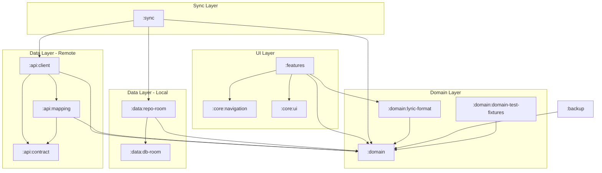

# PWS Core Modules

## :domain

**Group**: `io.github.alelk.pws.domain`

Central module with business logic. Platform-independent.

### Structure

```
domain/src/commonMain/kotlin/io/github/alelk/pws/domain/
├── song/           # Songs
├── book/           # Songbooks
├── songnumber/     # Song numbers in songbooks
├── tag/            # Tags/categories
├── songtag/        # Song-tag associations
├── favorite/       # Favorites
├── history/        # View history
├── search/         # Search
├── cross/          # Cross-references between songs
├── songreference/  # References to similar songs
├── auth/           # Authorization
├── payment/        # Payments (future)
└── core/           # Common utilities (Locale, etc.)
```

### Entity Package Organization

Each package is organized identically:

```
{entity}/
├── model/          # Domain models (data classes)
├── repository/     # Repository interfaces
├── usecase/        # Use cases
├── command/        # Command objects for writes
└── query/          # Query objects for reads
```

### Dependencies

- `kotlinx.serialization.core`
- `kotlinx.coroutines.core`

---

## :domain:domain-test-fixtures

Test fixtures for domain models.

### Contents

- Generators for property-based testing
- Repository mocks

---

## :domain:lyric-format

**Group**: `io.github.alelk.pws.domain`

Parsing and formatting song lyrics.

### Purpose

- Parsing structured song text (verses, choruses, bridges)
- Formatting lyrics for display
- Internationalization (i18n4k) — EN, UK, RU support

### Contents

```
lyric-format/src/commonMain/kotlin/io/github/alelk/pws/domain/lyric/format/
├── LyricParser.kt    # Text parser (Kudzu parser combinators)
└── LyricWriter.kt    # Output formatting
```

### Dependencies

- `:domain`
- Kudzu (parser combinators)
- i18n4k (internationalization)

---

## :api:contract

**Group**: `io.github.alelk.pws.api`

DTOs (Data Transfer Objects) for API.

### Purpose

- Serializable models for HTTP requests/responses
- Annotated with `@Serializable`
- Conform to backend API contract

---

## :api:client

**Group**: `io.github.alelk.pws.api`

HTTP client for backend API.

### Structure

```
api/client/src/commonMain/kotlin/
├── api/            # API endpoints
├── client/         # Ktor client configuration
├── config/         # Settings
├── error/          # Error handling
├── http/           # HTTP utilities
└── repository/     # Remote repositories
```

### Remote Repositories

Implement domain repository interfaces:

| Repository | Interface |
|------------|-----------|
| `RemoteSongReadRepository` | `SongReadRepository` |
| `RemoteSongWriteRepository` | `SongWriteRepository` |
| `RemoteBookReadRepository` | `BookReadRepository` |
| `RemoteBookWriteRepository` | `BookWriteRepository` |

### Dependencies

- `:domain`
- `:api:contract`
- `:api:mapping`
- Ktor Client (core, auth, content-negotiation)

---

## :api:mapping

Mapping between API DTOs and Domain models.

### Contents

- Extension functions for conversion
- `toDto()` and `toDomain()` functions

---

## :features

**Group**: `io.github.alelk.pws.features`

UI components on Compose Multiplatform.

### Structure

```
features/src/commonMain/kotlin/io/github/alelk/pws/features/
├── app/            # App-wide components (AppBar, etc.)
├── book/           # Songbook screen
├── books/          # Songbooks list
├── search/         # Search screen
├── song/           # Song screen
├── favorites/      # Favorites
├── history/        # History
├── tags/           # Tags
├── components/     # Reusable UI components
├── theme/          # Theme (colors, typography)
└── di/             # Koin modules
```

### Feature Organization

```
{feature}/
├── {Feature}Screen.kt      # Voyager Screen
├── {Feature}ViewModel.kt   # ViewModel
├── {Feature}UiState.kt     # UI State sealed class
└── components/             # Feature-specific components
```

### Dependencies

- `:domain`
- `:core:navigation`
- Compose Multiplatform
- Voyager (navigator, koin)
- Koin
- Lifecycle ViewModel

### TODO

1. Split into modules:

```
features/
├── feature-books/          # :features:books
├── feature-songs/          # :features:songs  
├── feature-favorites/      # :features:favorites
├── feature-search/         # :features:search
├── feature-tags/           # :features:tags
└── common/ 
```

2. Move theme/ to :core:ui
3. Add @Preview for each Screen

---

## :core:navigation

Shared navigation components.

### Contents

```kotlin
// Navigation.kt - navigation utilities

// SharedScreens.kt - screen definitions
sealed interface SharedScreen {
    // All possible app screens are defined here
}
```

### Usage

Features module creates Screen implementations for each SharedScreen.

---

## :core:ui

Shared UI components and utilities.

### Purpose

- Reusable low-level Compose components
- UI utilities and extensions
- Common modifiers

---

## :data:db-room

Room database for Android/iOS.

### Contents

- Entity classes (tables)
- DAO interfaces
- Database class
- Migrations
- Type converters

---

## :data:repo-room

Local repositories based on Room.

### Purpose

- Implement domain repository interfaces
- Work with Room DAOs
- Used in Android/iOS applications

---

## :backup

Backup functionality.

### Contents

- Data serialization/deserialization
- Export/import to file
- Data migration between versions

---

## :sync

Data synchronization between local DB and server.

See [SYNC.md](SYNC.md) for details.

### Structure

```
sync/
├── core/                    # Base interfaces and SyncManager
│   ├── SyncManager.kt
│   ├── ConflictResolver.kt
│   ├── PendingChange.kt
│   └── ConnectivityObserver.kt
├── favorites/               # Favorites synchronization
├── history/                 # History synchronization
├── tags/                    # Tags synchronization
├── overrides/               # User overrides synchronization
└── di/                      # Koin modules
```

### Purpose

- Offline-first architecture for mobile applications
- Pending changes queue for offline operation
- Conflict resolution during synchronization
- Background sync via WorkManager (Android)

### Dependencies

- `:domain` — repository interfaces
- `:data:repo-room` — local repositories
- `:api:client` — remote repositories

## Dependency Graph



