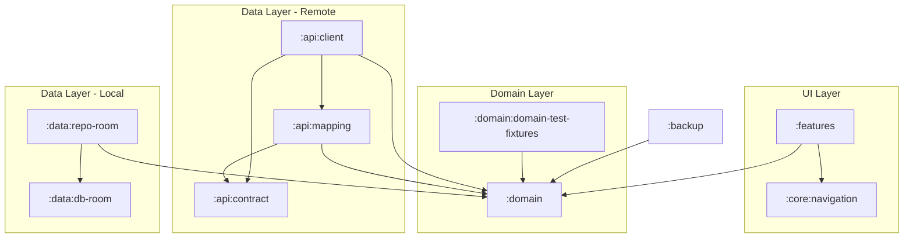

# Модули PWS Core

## :domain

**Группа**: `io.github.alelk.pws.domain`

Центральный модуль с бизнес-логикой. Не зависит от платформы.

### Структура

```
domain/src/commonMain/kotlin/io/github/alelk/pws/domain/
├── song/           # Песни
├── book/           # Сборники
├── songnumber/     # Номера песен в сборниках
├── tag/            # Теги/категории
├── songtag/        # Связь песен с тегами
├── favorite/       # Избранное
├── history/        # История просмотров
├── search/         # Поиск
├── cross/          # Связи между песнями
├── songreference/  # Ссылки на песни
├── auth/           # Авторизация
├── person/         # Авторы песен
├── tonality/       # Тональности
├── bookstatistic/  # Статистика по сборникам
├── payment/        # Платежи (future)
└── core/           # Общие утилиты
```

### Организация пакета сущности

Каждый пакет организован одинаково:

```
{entity}/
├── model/          # Domain модели (data classes)
├── repository/     # Repository interfaces
├── usecase/        # Use cases
├── command/        # Command объекты для записи
├── query/          # Query объекты для чтения
└── {Entity}.kt     # Value objects (если есть)
```

### Зависимости

- `kotlinx.serialization.core`
- `kotlinx.coroutines.core`

---

## :domain:domain-test-fixtures

Тестовые фикстуры для domain моделей.

### Содержимое

- Builders для создания тестовых данных
- Генераторы для property-based тестирования
- Моки репозиториев

---

## :api:contract

**Группа**: `io.github.alelk.pws.api`

DTO (Data Transfer Objects) для API.

### Назначение

- Сериализуемые модели для HTTP запросов/ответов
- Аннотированы `@Serializable`
- Соответствуют контракту backend API

---

## :api:client

**Группа**: `io.github.alelk.pws.api`

HTTP клиент для backend API.

### Структура

```
api/client/src/commonMain/kotlin/
├── api/            # API endpoints
├── client/         # Ktor клиент конфигурация
├── config/         # Настройки
├── error/          # Обработка ошибок
├── http/           # HTTP утилиты
└── repository/     # Remote репозитории
```

### Remote репозитории

Реализуют domain repository interfaces:

| Репозиторий | Интерфейс |
|-------------|-----------|
| `RemoteSongReadRepository` | `SongReadRepository` |
| `RemoteSongWriteRepository` | `SongWriteRepository` |
| `RemoteBookReadRepository` | `BookReadRepository` |
| `RemoteBookWriteRepository` | `BookWriteRepository` |

### Зависимости

- `:domain`
- `:api:contract`
- `:api:mapping`
- Ktor Client (core, auth, content-negotiation)

---

## :api:mapping

Маппинг между API DTO и Domain моделями.

### Содержимое

- Extension functions для конвертации
- `toDto()` и `toDomain()` функции

---

## :features

**Группа**: `io.github.alelk.pws.features`

UI компоненты на Compose Multiplatform.

### Структура

```
features/src/commonMain/kotlin/io/github/alelk/pws/features/
├── app/            # App-wide компоненты (AppBar, etc.)
├── book/           # Экран сборника
├── books/          # Список сборников
├── search/         # Экран поиска
├── song/           # Экран песни
├── favorites/      # Избранное
├── history/        # История
├── tags/           # Теги
├── components/     # Переиспользуемые UI компоненты
├── theme/          # Тема (цвета, типографика)
└── di/             # Koin модули
```

### Организация feature

```
{feature}/
├── {Feature}Screen.kt      # Voyager Screen
├── {Feature}ViewModel.kt   # ViewModel
├── {Feature}UiState.kt     # UI State sealed class
└── components/             # Feature-specific компоненты
```

### Зависимости

- `:domain`
- `:core:navigation`
- Compose Multiplatform
- Voyager (navigator, koin)
- Koin
- Lifecycle ViewModel

---

## :core:navigation

Общие навигационные компоненты.

### Содержимое

```kotlin
// Navigation.kt - навигационные утилиты

// SharedScreens.kt - определения экранов
sealed interface SharedScreen {
    // Определены все возможные экраны приложения
}
```

### Использование

Features модуль создает реализации Screen для каждого SharedScreen.

---

## :data:db-room

Room база данных для Android/iOS.

### Содержимое

- Entity классы (таблицы)
- DAO interfaces
- Database class
- Migrations
- Type converters

---

## :data:repo-room

Локальные репозитории на основе Room.

### Назначение

- Реализуют domain repository interfaces
- Работают с Room DAO
- Используются в Android/iOS приложениях

---

## :backup

Функционал резервного копирования.

### Содержимое

- Сериализация/десериализация данных
- Экспорт/импорт в файл
- Миграция данных между версиями

---

## Граф зависимостей



