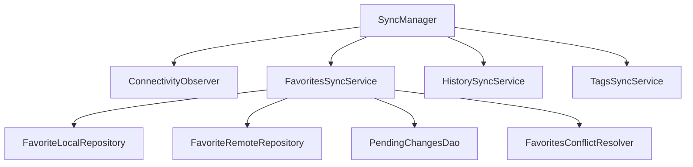

# Data Synchronization

This functionality is not yet implemented.

## Overview

Mobile applications (Android/iOS) operate in **offline-first** mode:
- Primary data source — local Room DB
- Synchronization with backend occurs when network is available
- User can work without internet

## Data Types by Synchronization

| Type               | Data                                      | Direction       | Priority |
|--------------------|-------------------------------------------|-----------------|----------|
| **Read-only**      | Songs, Songbooks, Global tags             | Server → Client | Low      |
| **User data**      | Favorites, History, User tags             | Bidirectional   | High     |
| **User overrides** | Overrides for global songs and tags       | Bidirectional   | High     |

## Synchronization Architecture

```
┌─────────────────────────────────────────────────────────────────┐
│                        Mobile App                               │
├─────────────────────────────────────────────────────────────────┤
│  ┌─────────────┐    ┌─────────────┐    ┌─────────────────────┐  │
│  │  UI Layer   │───▶│  Use Cases  │───▶│ Local Repository    │  │
│  └─────────────┘    └─────────────┘    │ (Room)              │  │
│                                        └──────────┬──────────┘  │
│                                                   │             │
│                                        ┌──────────▼──────────┐  │
│  ┌────────────────────────────────────▶│   Sync Manager      │  │
│  │ Network State                       │                     │  │
│  │ Observer                            │ - Pending Changes   │  │
│  │                                     │ - Conflict Resolver │  │
│  └─────────────────────────────────────│ - Sync Queue        │  │
│                                        └──────────┬──────────┘  │
│                                                   │             │
│                                        ┌──────────▼──────────┐  │
│                                        │  Remote Repository  │  │
│                                        │  (API Client)       │  │
│                                        └──────────┬──────────┘  │
└───────────────────────────────────────────────────┼─────────────┘
                                                    │
                                                    ▼
                                         ┌─────────────────────┐
                                         │   Backend Server    │
                                         └─────────────────────┘
```

## Sync Manager

Central synchronization component:

```kotlin
interface SyncManager {
    // Synchronization state
    val syncState: StateFlow<SyncState>
    
    // Start full synchronization
    suspend fun syncAll(): SyncResult
    
    // Synchronize specific entity
    suspend fun sync(entity: SyncableEntity): SyncResult
    
    // Track pending changes
    val pendingChangesCount: StateFlow<Int>
    
    // Force push pending changes
    suspend fun pushPendingChanges(): SyncResult
}

sealed class SyncState {
    object Idle : SyncState()
    object Syncing : SyncState()
    data class Error(val error: SyncError) : SyncState()
    data class Success(val timestamp: Instant) : SyncState()
}

enum class SyncableEntity {
    FAVORITES,
    HISTORY,
    USER_TAGS,
    SONG_TAGS,
    USER_OVERRIDES
}
```

## Pending Changes (Change Queue)

### Structure

```kotlin
@Entity(tableName = "pending_changes")
data class PendingChange(
    @PrimaryKey(autoGenerate = true)
    val id: Long = 0,
    val entityType: SyncableEntity,
    val entityId: Long,
    val operation: ChangeOperation,
    val payload: String,           // JSON serialized data
    val createdAt: Instant,
    val retryCount: Int = 0,
    val lastError: String? = null
)

enum class ChangeOperation {
    CREATE,
    UPDATE,
    DELETE
}
```

### Workflow

```
┌─────────────────────────────────────────────────────────────────┐
│                    Offline Change Flow                          │
├─────────────────────────────────────────────────────────────────┤
│                                                                 │
│  1. User Action (offline)                                       │
│     │                                                           │
│     ▼                                                           │
│  2. Save to Local DB                                            │
│     │                                                           │
│     ▼                                                           │
│  3. Create PendingChange record ──────────────────┐             │
│     │                                             │             │
│     ▼                                             │             │
│  4. UI updated immediately                        │             │
│                                                   │             │
│  ══════════════════════════════════════════════════════════════ │
│                    Network becomes available                    │
│  ══════════════════════════════════════════════════════════════ │
│                                                   │             │
│  5. SyncManager detects connectivity ◀────────────┘             │
│     │                                                           │
│     ▼                                                           │
│  6. Process PendingChanges queue                                │
│     │                                                           │
│     ├──▶ Success: Delete PendingChange                          │
│     │                                                           │
│     └──▶ Conflict: Resolve (see Conflict Resolution)            │
│                                                                 │
└─────────────────────────────────────────────────────────────────┘
```

## Conflict Resolution

### Conflict Resolution Strategies

| Entity         | Strategy                | Description                                   |
|----------------|-------------------------|-----------------------------------------------|
| Favorites      | Last-Write-Wins         | Last change wins                              |
| History        | Merge                   | Merge records, deduplicate by songId          |
| User Tags      | Last-Write-Wins + Merge | New tags are added, modified ones — LWW       |
| User Overrides | Last-Write-Wins         | Last change wins                              |

### Implementation

```kotlin
interface ConflictResolver<T> {
    suspend fun resolve(
        local: T,
        remote: T,
        base: T?  // last synchronized version
    ): ConflictResolution<T>
}

sealed class ConflictResolution<T> {
    data class UseLocal<T>(val data: T) : ConflictResolution<T>()
    data class UseRemote<T>(val data: T) : ConflictResolution<T>()
    data class Merge<T>(val data: T) : ConflictResolution<T>()
}
```

### Example: Favorites Conflict Resolver

```kotlin
class FavoritesConflictResolver : ConflictResolver<List<Favorite>> {
    override suspend fun resolve(
        local: List<Favorite>,
        remote: List<Favorite>,
        base: List<Favorite>?
    ): ConflictResolution<List<Favorite>> {
        // Find locally added (in local, not in base)
        val localAdded = local.filter { fav -> 
            base?.none { it.songId == fav.songId } ?: true 
        }
        
        // Find locally removed (in base, not in local)
        val localRemoved = base?.filter { baseFav ->
            local.none { it.songId == baseFav.songId }
        } ?: emptyList()
        
        // Merge: remote + localAdded - localRemoved
        val merged = remote
            .filter { remoteFav -> localRemoved.none { it.songId == remoteFav.songId } }
            .plus(localAdded.filter { added -> remote.none { it.songId == added.songId } })
        
        return ConflictResolution.Merge(merged)
    }
}
```

## Sync Timestamps

Each synchronizable entity has metadata:

```kotlin
@Entity(tableName = "sync_metadata")
data class SyncMetadata(
    @PrimaryKey
    val entityType: SyncableEntity,
    val lastSyncedAt: Instant?,
    val lastServerVersion: Long?,  // for optimistic locking
    val syncStatus: SyncStatus
)

enum class SyncStatus {
    SYNCED,
    PENDING_PUSH,
    PENDING_PULL,
    CONFLICT
}
```

## Network Connectivity Observer

```kotlin
interface ConnectivityObserver {
    val isConnected: StateFlow<Boolean>
    val connectionType: StateFlow<ConnectionType>
}

enum class ConnectionType {
    NONE,
    WIFI,
    CELLULAR,
    UNKNOWN
}

// Android implementation
class AndroidConnectivityObserver(
    private val context: Context
) : ConnectivityObserver {
    
    private val connectivityManager = 
        context.getSystemService<ConnectivityManager>()
    
    override val isConnected: StateFlow<Boolean> = 
        callbackFlow {
            val callback = object : ConnectivityManager.NetworkCallback() {
                override fun onAvailable(network: Network) {
                    trySend(true)
                }
                override fun onLost(network: Network) {
                    trySend(false)
                }
            }
            connectivityManager?.registerDefaultNetworkCallback(callback)
            awaitClose { 
                connectivityManager?.unregisterNetworkCallback(callback) 
            }
        }.stateIn(scope, SharingStarted.WhileSubscribed(), false)
}
```

## Sync Triggers

### Automatic Triggers

| Trigger               | Action                                  |
|-----------------------|-----------------------------------------|
| Network available     | `pushPendingChanges()`                  |
| App foreground        | `syncAll()` if > 5 min passed           |
| Pull-to-refresh       | `syncAll()`                             |
| Background (periodic) | `syncAll()` every 15 min (WorkManager)  |

### Auto-Sync Implementation

```kotlin
class AutoSyncManager(
    private val connectivityObserver: ConnectivityObserver,
    private val syncManager: SyncManager,
    private val scope: CoroutineScope
) {
    init {
        // Sync when network becomes available
        connectivityObserver.isConnected
            .filter { it }
            .onEach { 
                syncManager.pushPendingChanges()
            }
            .launchIn(scope)
    }
}
```

## Sync for Specific Entities

### Favorites Sync

```kotlin
class FavoritesSyncService(
    private val localRepo: FavoriteLocalRepository,
    private val remoteRepo: FavoriteRemoteRepository,
    private val pendingChangesDao: PendingChangesDao,
    private val conflictResolver: FavoritesConflictResolver
) {
    suspend fun sync(): SyncResult {
        // 1. Push pending changes
        val pending = pendingChangesDao.getByEntity(SyncableEntity.FAVORITES)
        for (change in pending) {
            try {
                when (change.operation) {
                    CREATE -> remoteRepo.addFavorite(change.entityId)
                    DELETE -> remoteRepo.removeFavorite(change.entityId)
                    else -> {}
                }
                pendingChangesDao.delete(change)
            } catch (e: ConflictException) {
                // Handle conflict
            }
        }
        
        // 2. Pull remote changes
        val remote = remoteRepo.getFavorites()
        val local = localRepo.getFavorites()
        
        // 3. Resolve conflicts
        val resolution = conflictResolver.resolve(local, remote, getBase())
        
        // 4. Apply resolution
        when (resolution) {
            is ConflictResolution.Merge -> {
                localRepo.replaceFavorites(resolution.data)
            }
            // ...
        }
        
        return SyncResult.Success
    }
}
```

### History Sync

```kotlin
class HistorySyncService(
    private val localRepo: HistoryLocalRepository,
    private val remoteRepo: HistoryRemoteRepository
) {
    suspend fun sync(): SyncResult {
        // History: append-only, simple merge
        
        // 1. Push local entries not yet synced
        val unsynced = localRepo.getUnsynced()
        if (unsynced.isNotEmpty()) {
            remoteRepo.addHistoryBatch(unsynced)
            localRepo.markAsSynced(unsynced.map { it.id })
        }
        
        // 2. Pull remote entries we don't have
        val lastSyncedAt = localRepo.getLastSyncTimestamp()
        val remoteNew = remoteRepo.getHistorySince(lastSyncedAt)
        localRepo.insertAll(remoteNew)
        
        return SyncResult.Success
    }
}
```

## UI Indication

### Sync Status in UI

```kotlin
@Composable
fun SyncStatusIndicator(
    syncState: SyncState,
    pendingCount: Int
) {
    Row(verticalAlignment = Alignment.CenterVertically) {
        when (syncState) {
            is SyncState.Syncing -> {
                CircularProgressIndicator(modifier = Modifier.size(16.dp))
                Text("Syncing...")
            }
            is SyncState.Error -> {
                Icon(Icons.Default.CloudOff, tint = Color.Red)
                Text("Sync error")
            }
            is SyncState.Idle -> {
                if (pendingCount > 0) {
                    Icon(Icons.Default.CloudUpload)
                    Text("$pendingCount changes pending upload")
                }
            }
            is SyncState.Success -> {
                Icon(Icons.Default.CloudDone, tint = Color.Green)
            }
        }
    }
}
```

### Offline Banner

```kotlin
@Composable
fun OfflineBanner(isConnected: Boolean) {
    AnimatedVisibility(visible = !isConnected) {
        Surface(
            color = MaterialTheme.colorScheme.errorContainer,
            modifier = Modifier.fillMaxWidth()
        ) {
            Text(
                text = "No network connection. Changes saved locally.",
                modifier = Modifier.padding(8.dp)
            )
        }
    }
}
```

## Modules and Dependencies

```
:sync/
├── core/                    # SyncManager, interfaces
├── favorites/               # FavoritesSyncService
├── history/                 # HistorySyncService
├── tags/                    # TagsSyncService
└── di/                      # Koin modules
```

### Dependency Graph



## Background Sync (Android)

```kotlin
class SyncWorker(
    context: Context,
    params: WorkerParameters,
    private val syncManager: SyncManager
) : CoroutineWorker(context, params) {
    
    override suspend fun doWork(): Result {
        return when (syncManager.syncAll()) {
            is SyncResult.Success -> Result.success()
            is SyncResult.Error -> Result.retry()
        }
    }
    
    companion object {
        fun schedule(context: Context) {
            val request = PeriodicWorkRequestBuilder<SyncWorker>(
                repeatInterval = 15,
                repeatIntervalTimeUnit = TimeUnit.MINUTES
            )
                .setConstraints(
                    Constraints.Builder()
                        .setRequiredNetworkType(NetworkType.CONNECTED)
                        .build()
                )
                .build()
            
            WorkManager.getInstance(context)
                .enqueueUniquePeriodicWork(
                    "pws_sync",
                    ExistingPeriodicWorkPolicy.KEEP,
                    request
                )
        }
    }
}
```

## Related Files

- `sync/core/SyncManager.kt`
- `sync/core/ConflictResolver.kt`
- `sync/core/PendingChange.kt`
- `sync/favorites/FavoritesSyncService.kt`
- `sync/history/HistorySyncService.kt`
- `data/db-room/dao/PendingChangesDao.kt`
- `data/db-room/dao/SyncMetadataDao.kt`
