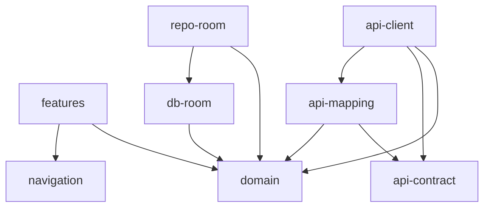

# PWS Core - Контекст для AI

## О проекте

**PWS (Praise & Worship Songs)** — мультиплатформенное приложение "Христианский песенник".
Позволяет искать, просматривать и управлять песнями из различных сборников.

### Связанные репозитории

| Репозиторий         | Описание                       | Технологии                    |
|---------------------|--------------------------------|-------------------------------|
| **pws-core** (этот) | Мультиплатформенная библиотека | Kotlin Multiplatform, Compose |
| **pws-server**      | Backend API сервер             | Ktor, PostgreSQL, Exposed     |
| **pws-android**     | Android приложение             | Android                       |

> **Важно**: Модули `:api:contract` и `:api:mapping` должны соответствовать API контракту pws-server.

## Платформы

| Платформа             | Источник данных   | Авторизация | Оффлайн |
|-----------------------|-------------------|-------------|---------|
| Android/iOS           | Локальная Room DB | Опционально | Да      |
| Web/Telegram Mini App | Remote API        | Да          | Нет     |

## Архитектурный паттерн

**Clean Architecture** с Use Cases, которые абстрагируют источник данных.

```
UI (Compose) → ViewModel → UseCase → Repository Interface
                                            ↓
                              LocalRepository OR RemoteRepository
```

## Технологический стек

| Категория    | Технология            |
|--------------|-----------------------|
| Язык         | Kotlin Multiplatform  |
| UI           | Compose Multiplatform |
| Навигация    | Voyager               |
| DI           | Koin                  |
| HTTP клиент  | Ktor                  |
| Сериализация | kotlinx.serialization |
| Тестирование | Kotest                |
| Локальная БД | Room (Android/iOS)    |

## Структура модулей

```
pws-core/
├── domain/              # Модели, Use Cases, Repository interfaces
│   ├── lyric-format/    # Парсинг текстов песен
│   └── test-fixtures/   # Тестовые данные
├── api/
│   ├── contract/        # DTO для API
│   ├── client/          # Ktor клиент, Remote репозитории
│   └── mapping/         # Маппинг DTO ↔ Domain models
├── features/            # UI компоненты (Compose + Voyager)
├── core/
│   ├── navigation/      # Навигация (SharedScreens)
│   └── ui/              # Общие UI компоненты
├── data/
│   ├── db-room/         # Room база данных
│   └── repo-room/       # Local репозитории на Room
└── backup/              # Бэкап/восстановление данных
```

## Ключевые сущности (Domain)

| Сущность        | Описание                                    |
|-----------------|---------------------------------------------|
| `Song`          | Песня с текстом и метаданными               |
| `SongDetail`    | Полные данные песни с тегами и ссылками     |
| `SongSummary`   | Краткая информация о песне для списков      |
| `Book`          | Сборник песен                               |
| `SongNumber`    | Связь песни со сборником (номер в сборнике) |
| `Tag`           | Категория/тег песни                         |
| `SongTag`       | Связь песни с тегом                         |
| `Favorite`      | Избранная песня пользователя                |
| `History`       | Запись истории просмотра                    |
| `SongReference` | Ссылки на похожие песни                     |

## Организация Domain модуля

Каждая сущность организована в отдельный пакет:

```
domain/src/commonMain/kotlin/io/github/alelk/pws/domain/
├── song/
│   ├── model/           # SongDetail, SongSummary, etc.
│   ├── repository/      # SongReadRepository, SongWriteRepository
│   ├── usecase/         # GetSongDetailUseCase, SearchSongsUseCase, etc.
│   ├── command/         # Commands для записи
│   └── query/           # Queries для чтения
├── book/
├── tag/
├── favorite/
├── history/
├── search/
└── ...
```

## Naming Conventions

| Тип               | Паттерн                                  | Пример                     |
|-------------------|------------------------------------------|----------------------------|
| Use Case          | `{Action}{Entity}UseCase`                | `GetSongDetailUseCase`     |
| Repository        | `{Entity}{Read/Write/Observe}Repository` | `SongReadRepository`       |
| ViewModel         | `{Feature}ViewModel`                     | `SongViewModel`            |
| Screen            | `{Feature}Screen`                        | `SongScreen`               |
| Remote Repository | `Remote{Entity}{Read/Write}Repository`   | `RemoteSongReadRepository` |

## Пакетные имена

- Domain: `io.github.alelk.pws.domain`
- Features: `io.github.alelk.pws.features`
- API Client: `io.github.alelk.pws.api`
- Navigation: `io.github.alelk.pws.core.navigation`

## Зависимости между модулями



## Принципы разработки

1. **Domain-first**: Сначала определяем модели и use cases в domain
2. **Platform-agnostic**: Domain модуль не зависит от платформы
3. **Repository Pattern**: Use cases работают через interfaces, не зная о реализации
4. **Reactive**: Используем Flow для реактивных данных
5. **Offline-first**: Мобильные приложения работают без сети, синхронизация при появлении. Авторизация опционально. Если пользователь не авторизован, то синхронизации не происходит.

## Синхронизация (Mobile)

Мобильные приложения используют **offline-first** подход:

- Все изменения сначала сохраняются локально
- При появлении сети — синхронизация с сервером
- Конфликты разрешаются автоматически (Last-Write-Wins или Merge)

Подробнее: [SYNC.md](../SYNC.md)

