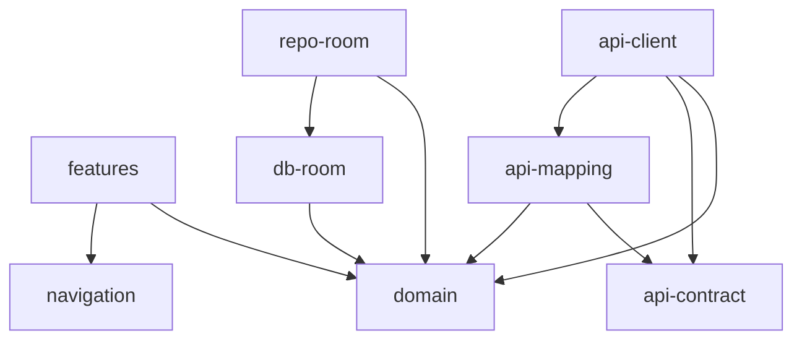

# PWS Core - Context for AI

## About the Project

**PWS (Praise & Worship Songs)** — a multiplatform "Christian Songbook" application.
Allows searching, viewing, and managing songs from various songbooks.

### Related Repositories

| Repository          | Description                    | Technologies                  |
|---------------------|--------------------------------|-------------------------------|
| **pws-core** (this) | Multiplatform library          | Kotlin Multiplatform, Compose |
| **pws-server**      | Backend API server             | Ktor, PostgreSQL, Exposed     |
| **pws-android**     | Android application            | Android                       |

> **Important**: Modules `:api:contract` and `:api:mapping` must match the pws-server API contract.

## Platforms

| Platform              | Data Source       | Authorization | Offline |
|-----------------------|-------------------|---------------|---------|
| Android/iOS           | Local Room DB     | Optional      | Yes     |
| Web/Telegram Mini App | Remote API        | Yes           | No      |

## Architectural Pattern

**Clean Architecture** with Use Cases that abstract the data source.

```
UI (Compose) → ViewModel → UseCase → Repository Interface
                                            ↓
                              LocalRepository OR RemoteRepository
```

## Technology Stack

| Category     | Technology            |
|--------------|-----------------------|
| Language     | Kotlin Multiplatform  |
| UI           | Compose Multiplatform |
| Navigation   | Voyager               |
| DI           | Koin                  |
| HTTP client  | Ktor                  |
| Serialization| kotlinx.serialization |
| Testing      | Kotest                |
| Local DB     | Room (Android/iOS)    |

## Module Structure

```
pws-core/
├── domain/              # Models, Use Cases, Repository interfaces
│   ├── lyric-format/    # Song lyrics parsing
│   └── test-fixtures/   # Test data
├── api/
│   ├── contract/        # API DTOs
│   ├── client/          # Ktor client, Remote repositories
│   └── mapping/         # DTO ↔ Domain models mapping
├── features/            # UI components (Compose + Voyager)
├── core/
│   ├── navigation/      # Navigation (SharedScreens)
│   └── ui/              # Shared UI components
├── data/
│   ├── db-room/         # Room database
│   └── repo-room/       # Local repositories on Room
└── backup/              # Backup/restore data
```

## Key Entities (Domain)

| Entity          | Description                                 |
|-----------------|---------------------------------------------|
| `Song`          | Song with lyrics and metadata               |
| `SongDetail`    | Full song data (lyric, author, tonalities)  |
| `SongSummary`   | Brief song info for lists                   |
| `Lyric`         | Song text as list of LyricPart (Verse, Chorus, Bridge) |
| `Book`          | Songbook (BookDetail, BookSummary)          |
| `SongNumber`    | Song number in book (bookId + number)       |
| `SongNumberId`  | Unique identifier for song-in-book (bookId/songId) |
| `Tag`           | Song category/tag with color                |
| `SongTag`       | Song-to-tag link                            |
| `Favorite`      | User's favorite song (subject + timestamp)  |
| `FavoriteSubject` | Sealed: BookedSong(songNumberId) or StandaloneSong(songId) |
| `FavoriteSong`  | Favorite with full song info for display    |
| `HistoryEntry`  | View history record with subject (BookedSong or StandaloneSong), songName, viewedAt, viewCount |
| `HistorySubject`| Sealed: BookedSong(songNumberId) or StandaloneSong(songId) |
| `SongReference` | Links to similar songs                      |
| `Person`        | Author/translator/composer name (value class) |
| `Tonality`      | Musical tonality (enum)                     |
| `UserDetail`    | User account information                    |

## Key Domain Patterns

### Value Objects (core/)

Domain uses Kotlin value classes with self-validation:

```kotlin
@JvmInline
value class SongId(val value: Long) {
  init { require(value >= 0) { "song id must not be negative" } }
}
```

Key value objects: `SongId`, `BookId`, `TagId`, `UserId`, `SongNumberId`, `NonEmptyString`, `Year`, `Color`, `Locale`, `Version`, `Person`, `Tonality`

### Sealed Result Types (core/result/)

Operations return sealed results instead of throwing exceptions:

```kotlin
sealed interface CreateResourceResult<out R : Any> {
  data class Success<out R : Any>(val resource: R) : CreateResourceResult<R>
  data class AlreadyExists<out R : Any>(val resource: R, val message: String) : Failure<R>
  data class ValidationError<out R : Any>(val resource: R, val message: String) : Failure<R>
}
```

Available: `CreateResourceResult`, `UpdateResourceResult`, `UpsertResourceResult`, `DeleteResourceResult`, `ToggleResourceResult`, `ClearResourcesResult`

### OptionalField for Patch Operations

Used in update commands to distinguish between "no change", "set value", and "clear value":

```kotlin
sealed interface OptionalField<out T> {
  data object Unchanged : OptionalField<Nothing>
  data class Set<T>(val value: T) : OptionalField<T>
  data object Clear : OptionalField<Nothing>
}

// Usage in UpdateSongCommand:
data class UpdateSongCommand(
  val id: SongId,
  val name: NonEmptyString? = null,           // null = no change
  val author: OptionalField<Person?> = OptionalField.Unchanged  // Unchanged/Set/Clear
)
```

### TransactionRunner

Abstraction for database transactions, allowing platform-specific implementations:

```kotlin
interface TransactionRunner {
  suspend fun <T> inRoTransaction(block: suspend RoTransactionScope.() -> T): T
  suspend fun <T> inRwTransaction(block: suspend RwTransactionScope.() -> T): T
}
```

Use `NoopTransactionRunner` for tests.

## Domain Module Organization

Each entity is organized in a separate package:

```
domain/src/commonMain/kotlin/io/github/alelk/pws/domain/
├── song/
│   ├── model/           # SongDetail, SongSummary, Lyric, etc.
│   ├── repository/      # SongReadRepository, SongWriteRepository, SongObserveRepository
│   ├── usecase/         # GetSongDetailUseCase, SearchSongsUseCase, etc.
│   ├── command/         # CreateSongCommand, UpdateSongCommand
│   └── query/           # SongQuery, SearchQuery, SongSort
├── book/
├── bookstatistic/
├── songnumber/
├── tag/
├── songtag/
├── favorite/
├── history/
├── cross/               # Cross-module projections
├── songreference/
├── auth/
├── payment/
├── person/              # Person value object
├── tonality/            # Tonality enum
└── core/                # ids/, pagination/, result/, transaction/, value objects
```

## Naming Conventions

| Type              | Pattern                                  | Example                    |
|-------------------|------------------------------------------|----------------------------|
| Use Case          | `{Action}{Entity}UseCase`                | `GetSongDetailUseCase`     |
| Repository        | `{Entity}{Read/Write/Observe}Repository` | `SongReadRepository`       |
| ViewModel         | `{Feature}ViewModel`                     | `SongViewModel`            |
| Screen            | `{Feature}Screen`                        | `SongScreen`               |
| Remote Repository | `Remote{Entity}{Read/Write}Repository`   | `RemoteSongReadRepository` |

## Package Names

- Domain: `io.github.alelk.pws.domain`
- Features: `io.github.alelk.pws.features`
- API Client: `io.github.alelk.pws.api`
- Navigation: `io.github.alelk.pws.core.navigation`

## Module Dependencies



## Development Principles

1. **Domain-first**: First define models and use cases in domain
2. **Platform-agnostic**: Domain module doesn't depend on platform
3. **Repository Pattern**: Use cases work through interfaces, unaware of implementation
4. **Reactive**: Use Flow for reactive data
5. **Offline-first**: Mobile apps work without network, sync when available. Authorization is optional. If user is not authorized, no synchronization occurs.

## Key Features

### Song Search

Full-text search with PostgreSQL FTS on server, Room FTS5 on mobile.

**API Endpoints (uniform interface):**
- `GET /v1/songs/search` - global songs (public)
- `GET /v1/user/songs/search` - global + user songs (auth required)

**Response includes:**
- `bookReferences` - list of books containing the song with `bookId`, `displayShortName`, `songNumber`
- Used for navigation to song in book context

See: [features/search.md](../features/search.md)

### User Overrides

Users can customize global songs without modifying originals.

**Pattern:** Global song + User override → Merged view

See: [features/user-overrides.md](../features/user-overrides.md)

## Synchronization (Mobile)

Mobile applications use **offline-first** approach:

- All changes are first saved locally
- When network appears — synchronization with server
- Conflicts are resolved automatically (Last-Write-Wins or Merge)

Details: [SYNC.md](../SYNC.md)
